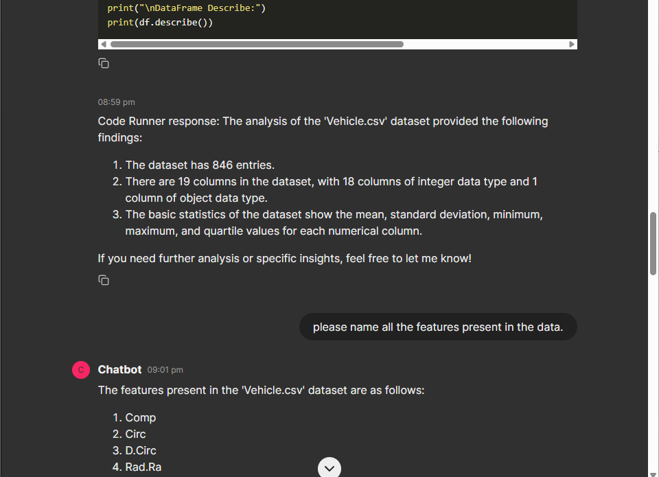

# GPT_Code_Interprator

## Overview

This application uses OpenAI APIs to create a chat-based code interpreter with a UI built using Chainlit.

## The Problem Statment:
This is a Demo project to demostrate on the below Problem statement:
- You’ve to develop a Chat Code-Interpreter application using OpenAI APIs (gpt-3.5-turbo mainly). 
    - For UI you’ve to use Chainlit. 
    - Please don’t use LangChain or LlamaIndex or any such framework. 
    - Try to solve this using first principles and use the openai library in Python. 
    - The output should’ve the following things. Please don’t use the Assistants API as well.
- The input will be .csv files and some user message similar to what we’ve in ChatGPT code interpreter (advanced data analytics)
Based on the message the assistant should write code and execute it.
- The user can even do general chit-chat so please be ready for that as well.
- Write reusable code and modules.
- The UI should be done using Chainlit strictly.
- To show the output create a GitHub repo with a Readme.md file
- Please add Dockerfile in the Github repo and take OPENAI_API_KEY as an environment variable so that we can run your code and check the output.

## Limitations
- This app is designed for single chat at a time.
- You have an options to attach a file but is limited to only CSV files.
- It will not explicitly ask you to upload any csv file but it can detect attachment and consume it.
- The app is not designed to generate image or any other media as its GPT3.5 Turbo under the hood.
- You can also perform casual chat if you wish to.
- By default the personlaity of the chat agent is set for a Data Scientist if you wish to change that provide prompts accordingly.

## To Experiance the App start with the new Chat. Thankyou !

# Demonstration

- ### At start you will be greeted with the following screen

- ### You can start chatting with the bot stright away. Following are the series of chat that i had to test its functionality.





# Setup

### Local Setup

1. Clone the repository:
    ```bash
    git clone https://github.com/B-S-B/GPT_Code_Interpreter.git
    cd GPT_Code_Interpreter
    ```

2. Create a virtual environment and install dependencies:
    ```bash
    python3 -m venv venv
    source venv/bin/activate
    pip install -r requirements.txt
    ```
3. Add openAI's API key to the environment by either
    
    If you dont have your openAI Api_key you can get it from [OpenAI API key page](https://platform.openai.com/api-keys) or [refer](https://help.openai.com/en/articles/4936850-where-do-i-find-my-openai-api-key).

    ```bash
    setx OPENAI_API_KEY “<yourkey>”
    ```
    verify it by
    ```bash
    echo %OPENAI_API_KEY%
    ```
    **OR**
    
    Create a file named ```.env``` in the same folder as your ```chainlit_app.py``` file. <br>
    Add your OpenAI API key in the ```OPENAI_API_KEY``` variable. <br>
    The file content will be
    ```text
    OPENAI_API_KEY='<yourkey>'
    ```

4. Run the application:
    ```bash
    chainlit run chainlit_app.py
    ```

### Docker Setup

1. Build the Docker image:
    ```bash
    docker build -t gpt_with_interpreter .
    ```

2. Run the Docker container:
    ```bash
    docker run -e OPENAI_API_KEY=your_openai_api_key -p 8000:8000 gpt_with_interpreter
    ```

## Usage

- Upload CSV files and provide instructions to analyze the data.
- Engage in general chit-chat.

## Environment Variables

- `OPENAI_API_KEY`: Your OpenAI API key.
